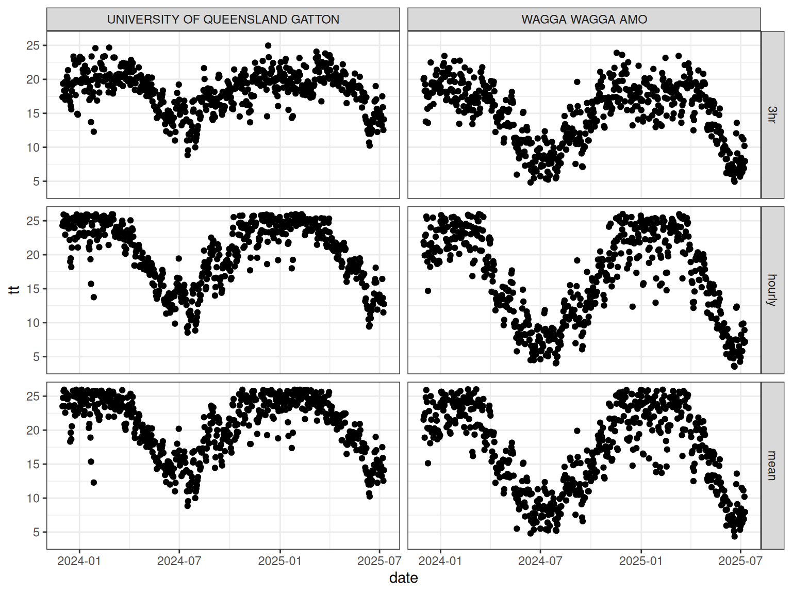
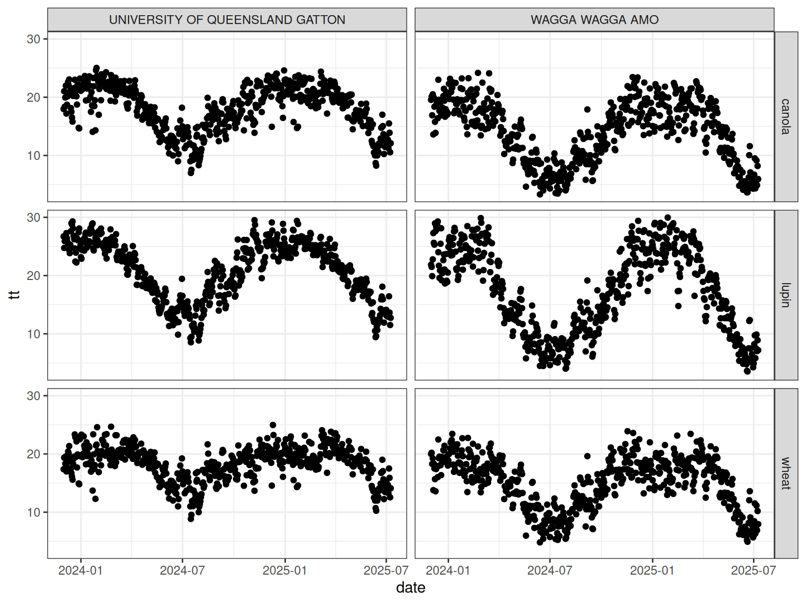

# Thermal Time

``` r

library(apsimwise)
library(dplyr)
library(ggplot2)
```

## Introduction

Thermal time is one of the most commonly used concepts in crop
modelling. It is widely used to describe crop development and phenology
and forms the basis of many APSIM crop models.

The apsimwise ecosystem provides a consistent interface for calculating
thermal time across multiple crops while maintaining crop-specific
algorithms and default parameter values.

This vignette explains the design philosophy and demonstrates how the
different apsimwise packages work together.

## Design Philosophy

The apsimwise ecosystem separates calculation of thermal times into
three layers:

- apsimwise as the user facing interface
- rapsimng.\* as crop specific parameters
- tidyweather as the generic thermal time functions


The separation has three goals:

1.  Avoid duplicating generic calculations.
2.  Keep crop-specific knowledge close to each crop package.
3.  Provide a simple user-facing interface.

The weather data in APSIM format is read using
[`read_weather()`](https://byzheng.github.io/tidyweather/reference/read_weather.html)
from the `tidyweather` package.

``` r

library(tidyweather)
met_files <- system.file(
    c("extdata/ppd_72150.met", "extdata/ppd_40082.met"),
    package = "tidyweather"
)
records <- bind_rows(
    read_weather(met_files[1]),
    read_weather(met_files[2])
)
```

### Layer 1: Generic Weather Functions

The [tidyweather](https://tidyweather.bangyou.me) package contains
weather-related calculations that are independent of crop type.

The daily thermal time is calculated using the
[`thermal_time()`](https://apsimwise.bangyou.me/reference/thermal_time.md)
function with specified temperature response parameters (e.g. three
cardinal temperatures) using tidyverse syntax.

Three methods are available for calculating daily thermal time:

- Daily mean temperature
- [Three-hourly estimates of air
  temperature](https://notes.apsimng.bangyou.me/docs/Models/Functions/ThreeHourAirTemperature.html)
- [Hourly estimates of air temperature by interpolating between daily
  maximum and minimum temperatures using a sinusoidal method during
  sunlight hours and an exponential decline during nighttime
  hours](https://notes.apsimng.bangyou.me/docs/Models/Functions/HourlySinPpAdjusted.html)

Daily mean temperature is the simplest method and is suitable for most
applications.

``` r

tt_mean <- records |>
    mutate(
        tt = tidyweather::thermal_time(
            mint = mint,
            maxt = maxt,
            x_temp = c(0, 26, 37),
            y_temp = c(0, 26, 0)
        )
    ) |>
    mutate(method = "mean")
```

Method `3hr` uses three-hourly estimates of air temperature to calculate
thermal time.

``` r

tt_3hour <- records |>
    mutate(
        tt = tidyweather::thermal_time(
            mint = mint,
            maxt = maxt,
            x_temp = c(0, 26, 37),
            y_temp = c(0, 26, 0),
            method = "3hr"
        )
    ) |>
    mutate(method = "3hr")
```

Method `HourlySinPpAdjusted` uses hourly estimates of air temperature to
calculate thermal time which requires the `date` and `latitude`.
Argument `latitude` requires a single value for each weather record. In
case of multiple weather records, `group_by(name)` can be used to ensure
that the first latitude value is used for each weather record.

``` r

tt_hourly <- records |>
    group_by(name) |>
    mutate(
        tt = tidyweather::thermal_time(
            mint = mint,
            maxt = maxt,
            x_temp = c(0, 26, 37),
            y_temp = c(0, 26, 0),
            date = date,
            latitude = latitude[1],
            method = "HourlySinPpAdjusted"
        )
    ) |>
    mutate(method = "hourly")
```

``` r

tt_all <- bind_rows(tt_mean, tt_3hour, tt_hourly)
tt_all |>
    ggplot() +
    geom_point(aes(x = date, y = tt)) +
    theme_bw() +
    facet_grid(method~name)
```



Figure 1

The `tidyweather` package does not contain crop-specific parameters.

### Layer 2: Crop-Specific Packages

Crop-specific packages provide thermal time related parameter values for
individual crops which match the crop configuration in APSIM NG
including:

- `rapsimng.wheat`
- `rapsimng.canola`
- `rapsimng.chickpea`
- `rapsimng.lentil`
- `rapsimng.lupin`
- `rapsimng.fababean`

The crop parameters can be accessed using the
[`crop()`](https://apsimwise.bangyou.me/reference/crop.md) function
directly from the crop package.

``` r

rapsimng.wheat::wheat$get("phenology.thermal_time")
#> $x
#> [1]  0 26 37
#> 
#> $y
#> [1]  0 26  0
rapsimng.canola::canola$get("phenology.thermal_time")
#> $x
#> [1]  2 30 35
#> 
#> $y
#> [1]  0 28  0
rapsimng.lupin::lupin$get("phenology.thermal_time")
#> $x
#> [1]  0 30 40
#> 
#> $y
#> [1]  0 30  0
```

The crop-specific thermal times are calculated using the
[`thermal_time()`](https://apsimwise.bangyou.me/reference/thermal_time.md)
function in each package.

The following examples demonstrate how to calculate thermal time for
wheat, lupin, and canola using the crop-specific packages.

Wheat uses the three hourly method to calculate thermal time.

``` r


tt_wheat <- records |>
    mutate(
        tt = rapsimng.wheat::thermal_time(
            mint = mint,
            maxt = maxt
        )
    ) |>
    mutate(crop = "wheat")
```

Lupin uses the hourly method to calculate thermal time which requires
the `date` and `latitude`. Argument `latitude` requires a single value
for each weather record. In case of multiple weather records,
`group_by(name)` can be used to ensure that the first latitude value is
used for each weather record.

``` r


tt_lupin <- records |>
    group_by(name) |>
    mutate(
        tt = rapsimng.lupin::thermal_time(
            mint = mint,
            maxt = maxt,
            date = date,
            latitude = latitude[1]
        )
    ) |>
    mutate(crop = "lupin")
```

Canola also uses the three hourly method but different cardinal
temperatures to calculate thermal time.

``` r

tt_canola <- records |>
    mutate(
        tt = rapsimng.canola::thermal_time(
            mint = mint,
            maxt = maxt
        )
    ) |>
    mutate(crop = "canola")
```

``` r

tt_crop <- bind_rows(tt_wheat, tt_lupin, tt_canola)
tt_crop |>
    ggplot() +
    geom_point(aes(x = date, y = tt)) +
    theme_bw() +
    facet_grid(crop~name)
```



Figure 2

### Layer 3: apsimwise

The `apsimwise` package provides a unified interface for users. Instead
of remembering which package contains a function, users can work through
a common API.

The thermal times are calculated using the
[`thermal_time()`](https://apsimwise.bangyou.me/reference/thermal_time.md)
function in the `apsimwise` package for wheat, lupin, and canola.

``` r

tt_wheat <- records |>
    mutate(
        tt = apsimwise::thermal_time(
            mint = mint,
            maxt = maxt,
            crop = "wheat"
        )
    ) |>
    mutate(crop = "wheat")
tt_lupin <- records |>
    group_by(name) |>
    mutate(
        tt = apsimwise::thermal_time(
            mint = mint,
            maxt = maxt,
            date = date,
            latitude = latitude[1],
            crop = "lupin"
        )
    ) |>
    mutate(crop = "lupin")
tt_canola <- records |>
    mutate(
        tt = apsimwise::thermal_time(
            mint = mint,
            maxt = maxt,
            crop = "canola"
        )
    ) |>
    mutate(crop = "canola")
```

``` r

tt_all <- bind_rows(tt_wheat, tt_lupin, tt_canola)
tt_all |>
    ggplot() +
    geom_point(aes(x = date, y = tt)) +
    theme_bw() +
    facet_grid(crop~name)
```


Figure 3

apsimwise automatically dispatches the calculation to the appropriate
crop package while preserving crop-specific defaults.

## Overriding Parameters in the apsimwise Layer

There are two ways to override the default crop parameters in the
apsimwise layer.

- Parameters can also be supplied directly to the function call.
- The crop parameters can be modified using the
  [`crop()`](https://apsimwise.bangyou.me/reference/crop.md) function.

### Overriding Parameters in the Function Call

``` r

records |>
    group_by(name) |>
    mutate(
        tt = apsimwise::thermal_time(
            mint = mint,
            maxt = maxt,
            date = date,
            latitude = latitude[1],
            crop = "lupin",
            x_temp = c(0, 25, 35),
            y_temp = c(0, 25, 0)
        )
    )
```

This allows temporary experimentation without modifying global crop
settings.

### Overriding Parameters in the `crop()` function

[`crop()`](https://apsimwise.bangyou.me/reference/crop.md) can be used
to modify the default crop parameters in the `apsimwise` package. This
allows users to customise parameters for all following calculations.

``` r

apsimwise::crop("lupin")$set(
    "phenology.thermal_time.x" = c(0, 25, 35),
    "phenology.thermal_time.y" = c(0, 25, 0)
)
records |>
    group_by(name) |>
    mutate(
        tt = apsimwise::thermal_time(
            mint = mint,
            maxt = maxt,
            date = date,
            latitude = latitude[1],
            crop = "lupin"
        )
    )
```
